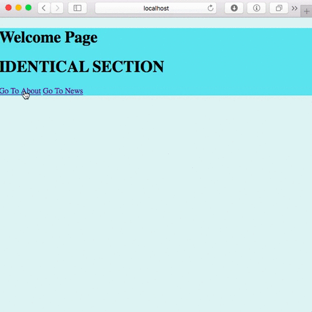

# Turbowebsite

Turbowebsite = VDOM + PJAX

PJAX = PushState + AJAX

Turbowebsite is a drop-in javascript file that magically makes websites run faster!

To be more precise, Turbowebsite makes ajax requests instead of switching to a new webpage on link click. It uses vdom to identify changes between the old page and new, and applies changes to needed sections.



## Roadmap

Turbowebsite is in a basic stage right now, being only able to speed up a static HTML website. Support for form submission and scripts is next, and will hopefully make Turbowebsite a usable script for most websites. Future plans include customization options and eventually a hookable API.

## Installation

1. Drop `dist/client/main.js` into any website

2. Include it with a script tag at the end of `<body />`

```
	<body>
		...content...
		<script type="text/javascript" src="LINKTOSCRIPT"></script>
	</body>
```

## Example usage

[looklikeapro.github.io](http://looklikeapro.github.io)

## Development

	# Clone project
	npm install
	npm run hot-dev-server
	# Access live reloading file at http://localhost:2992/static/main.js
